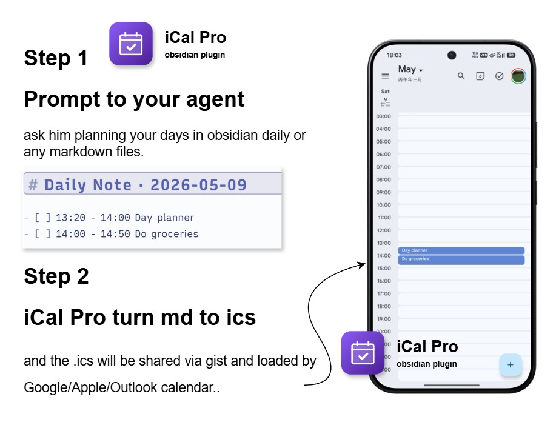

# iCal Pro for Obsidian

Manage your tasks in Markdown and expose them to Google Calendar, Apple Calendar, and Outlook via standards-compliant iCalendar feeds.

> **The Professional Standard for Obsidian Calendar Sync.**
> - **High-Fidelity**: Strict RFC 5545 compliance (folding, CRLF, escaping).
> - **Zero Dependency**: Works natively with **Tasks** and **Day Planner** syntax without requiring those plugins to be installed.
> - **Privacy First**: Local-first architecture with optional GitHub Gist sync.
> - **Deep Logic**: Intelligent `VEVENT` vs `VTODO` semantic splitting.

---

## 🔒 Privacy & Security

iCal Pro is built with a local-first philosophy.
- **No Data Collection**: We do not track your usage or collect any personal data.
- **Direct Sync**: Your calendar is synced directly from your device to your local file or GitHub Gist.
- **Secure Storage**: Your GitHub PAT is stored securely within Obsidian's local storage and is only used to communicate with the GitHub API.

## Core Capabilities

- **Intelligent Sync**: Automatically splits tasks into `VEVENT` (timed) and `VTODO` (dated/floating).
- **Zero-Dependency Discovery**: Inherits dates from Daily Note filenames or headings without requiring extra plugins.
- **Reliable Identity**: Stable `UID` generation ensures no duplicates when tasks move between files.
- **Flexible Destinations**: Sync to a local vault file or a private GitHub Gist for universal access.

## Supported Syntax

iCal Pro intelligently categorizes tasks based on the presence of **Time**.

| Feature | Syntax Example | Result (iCalendar) |
| :--- | :--- | :--- |
| **Event** (Timed) | `- [ ] 2026-04-01 13:00-14:00 Task` | `VEVENT` (Visible in Grid) |
| **To-Do** (Dated) | `- [ ] 2026-04-01 Task` | `VTODO` (Sidebar/Reminders) |
| **To-Do** (Floating)| `- [ ] Task` | `VTODO` (Unscheduled) |
| **Priority** | `⏫ High` / `🔼 Medium` / `🔽 Low` | `PRIORITY: 1 / 5 / 9` |
| **Alarms** | `⏰ 15` (15 minutes before) | `VALARM` |
| **Recurrence**| `🔁 every weekday` | `RRULE` |
| **Context** | `## 2026-04-01` (Heading) | Inherited Date (Day Planner) |

> [!IMPORTANT]
> **Google Calendar Compatibility**: Google Calendar **does not support** `VTODO`. If you want your tasks to appear in the Google Calendar grid, you **must** include a time (e.g., `13:00`).

## Core Capabilities

- **Multi-Source Rules**: Bind specific vault paths to distinct calendar categories.
- **Granular Filtering**: Include/Exclude by global filters, tags, or categories.
- **Task Fidelity**: Native support for **Priority** (`⏫🔼🔽`), **Recurrence** (`🔁`), and **Alarms** (`⏰`).
- **Rich Context**: Full body capture from indented lists or blockquotes mapped to `DESCRIPTION`.
- **Diagnostics**: Built-in sync preview, destination reports, and redacted debug bundles.

## Compatible Calendars

iCal Pro produces RFC 5545 `.ics` output intended to work with:

- Google Calendar subscription
- Apple Calendar
- Outlook
- Proton Calendar
- Thunderbird
- Other clients that support iCalendar subscriptions

Client support for `VTODO` varies. Apple-oriented ecosystems usually handle `VTODO` better than Google Calendar.

## Getting Started

1. Install with [BRAT](https://github.com/TfTHacker/obsidian42-brat) using `liuh886/obsidian-ical-plugin-pro`
2. Open the `iCal Pro` settings tab
3. Add at least one source path rule
4. Enable at least one destination:
   - local vault file export
   - GitHub Gist sync
5. If you use Gist, fill in username, Gist ID, and PAT, then click `Validate`
6. Click `Sync Now`
7. Subscribe to the generated raw Gist URL or local `.ics` file

## Debugging & Logs

If you encounter issues, you can enable verbose logging:

1. Open **Settings** > **iCal Pro**.
2. Scroll to the **Advanced & Diagnostics** section.
3. Toggle **Debug Mode** to **ON**.
4. Open the Obsidian developer console (press `Ctrl+Shift+I` on Windows/Linux or `Cmd+Option+I` on macOS).
5. Look for logs prefixed with `[info][ical]` or `iCal Pro:`.

You can also use the **Copy Diagnostics** button in the status card to generate a redacted summary of your configuration and recent sync history to include in bug reports.

## FAQ

**Q: Why don't my To-Dos (VTODO) show up in Google Calendar?**
A: Google Calendar natively only supports `VEVENT`. For full `VTODO` support, we recommend using Apple Calendar, Microsoft Outlook, or dedicated task managers like Reminders that support iCal subscriptions.

**Q: Is it safe to use GitHub Gist?**
A: Yes. Your Gist is yours. We recommend using a private Gist for maximum privacy. Your Personal Access Token never leaves your machine except to communicate with GitHub.

## Development

- `npm run build`
- `npm run typecheck`
- `npm run test:smoke`
- `npm run validate`

## License

MIT

---

## Support

If you find this plugin useful and want to support its development, you can buy me a coffee!

